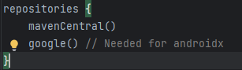

# Installation Directions
The installation of Xenith into your project is a very simple process. First, ensure you have the 
latest version of the [FtcRobotController](https://github.com/First-Tech-Challenge/FtcRobotController) 
project. Now, follow the steps below.

## Install Kotlin
_If you already have Kotlin installed in your project, skip to [installing Xenith](#Install-Xenith)_

**Note:** Xenith only officially supports Kotlin. If you expect to receive guidance with using
Xenith and Java, you are in the wrong place. However, Xenith may still be usable in Java, although
no promises are made.

First, we need to install the Kotlin dependency. 

1. Open your root `build.gradle` file.
2. At the very top of the `buildscript` block, add these three lines:
```groovy
ext {
    kotlin_version = '1.9.21'
}
```
3. Now, scroll down to the `buildscript.dependencies` block. Add this line:
```groovy
classpath "org.jetbrains.kotlin:kotlin-gradle-plugin:$kotlin_version"
```

Kotlin is now installed in your project!

## Install Xenith
Now that Kotlin is installed, you can install Xenith into your project.

1. Open `build.dependencies.gradle` and locate the `repositories` block. It should look like this:

2. At the end of this  block, add this line:
```groovy
maven { url 'https://jitpack.io' }
```
3. Scroll down to the `dependencies` block.
4. Add the following line at the end of the block:
```groovy
implementation 'com.github.rowan-mcalpin:xenith:0.0.0.3'
```

Finally, sync your Gradle project, and Xenith is installed!